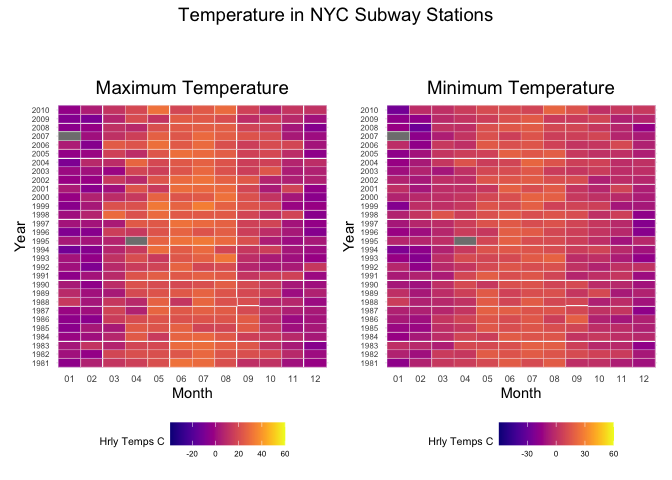

p8105_hw3_av2718
================
Angelica Vina Albarracin
2022-10-15

## Problem 2

This problem focuses on the Accelerometers data. Below we import and
clean data from `accel_data.csv`. The process begins with importing the
data and cleaning the variables names:

``` r
library(readr)
accel_data = read_csv("data/accel_data.csv") %>% # import data
  janitor::clean_names() %>% # tidy variable names
  mutate_if(is.double, as.numeric) #if double mutate variable to numeric
```

We quickly recognize a problem: the `activity` data is spread across
1443 columns, which correspond to 1443 activity counts for each minute
of a 24-hour day. To address this and organize the data, we will use
`pivot_longer`to wangle the activity data and create two new variables
`workweek` and `weekday`:

``` r
accel_data_tidy =  
  pivot_longer(   # organize activity data 
    accel_data,
    activity_1:activity_1440,
    names_to = "time_course",
    values_to = "activity_count",
    names_prefix = "activity_"                  
  ) %>%
  mutate(.data = .,  # new weekday vs weekend variable
         workweek = if_else(day %in% c("Saturday", "Sunday"), "weekend", "weekday"),
         weekday = fct_relevel(day, "Monday", "Tuesday", "Wednesday", "Thursday", "Friday", "Saturday", "Sunday")) 

head(accel_data_tidy, 8) # view first 8 rows of tidied data
## # A tibble: 8 × 7
##    week day_id day    time_course activity_count workweek weekday
##   <dbl>  <dbl> <chr>  <chr>                <dbl> <chr>    <fct>  
## 1     1      1 Friday 1                     88.4 weekday  Friday 
## 2     1      1 Friday 2                     82.2 weekday  Friday 
## 3     1      1 Friday 3                     64.4 weekday  Friday 
## 4     1      1 Friday 4                     70.0 weekday  Friday 
## 5     1      1 Friday 5                     75.0 weekday  Friday 
## 6     1      1 Friday 6                     66.3 weekday  Friday 
## 7     1      1 Friday 7                     53.8 weekday  Friday 
## 8     1      1 Friday 8                     47.8 weekday  Friday
```

The resulting dataset has only 6 variables: activity_count, day, day_id,
time_course, week, weekday, workweek, and a size of 50400, 7. Using this
tidied dataset, we will now aggregate across minutes to create a
`total_activity` variable for each day, and create a table showing these
totals:

``` r
total_activity = accel_data_tidy %>%  
  group_by(day,week) %>%           # Group total activity by day and week 
  summarize(day_total = sum(activity_count)) %>% 
  mutate(week = as.character(week))


pivot_wider(                 # Create friendly table for "human readers"
  total_activity,
  names_from = "day",
  values_from = "day_total"
)
## # A tibble: 5 × 8
##   week   Friday  Monday Saturday Sunday Thursday Tuesday Wednesday
##   <chr>   <dbl>   <dbl>    <dbl>  <dbl>    <dbl>   <dbl>     <dbl>
## 1 1     480543.  78828.   376254 631105  355924. 307094.   340115.
## 2 2     568839  295431    607175 422018  474048  423245    440962 
## 3 3     467420  685910    382928 467052  371230  381507    468869 
## 4 4     154049  409450      1440 260617  340291  319568    434460 
## 5 5     620860  389080      1440 138421  549658  367824    445366
```

As expected, from the table, we observe different total activity levels
depending on the day of the week. The patient seems to be more active
during the weekdays vs weekends. However, the data presented in this
table isn’t enough to make any conclusions. We would need to conduct
further analysis. Nonetheless, from this table, we can observe on
Saturday week 4 and Saturday week 5 two unusual measurements, possibly
due to a device malfunction. It’s good that we noticed this issue, as it
will affect our analysis and results.

We will now use what we have learned in class to the inspection activity
over the course of the day. In the code chuck below we will create a
single-panel `plot` that shows the 24-hour activity time courses for
each day and use color to indicate the day of the week:

``` r
inspec_activity = 
  ggplot(accel_data_tidy, aes(x = time_course, y = activity_count, color = day)) +
  geom_line() +
  scale_color_viridis(discrete = TRUE) +
  theme(legend.position = "bottom") +
  theme(plot.title = element_text(hjust = 0.5)) + 
  labs(
    title = "24-hour Accelerometer Activity Count for Each Week Day",  
    x = "Time Course (Minutes)",
    y = "Activity Count"  
    )

inspec_activity
```

<!-- -->

Based on this graph, we can say that the patient’s physical activity
fluctuates across the day. In general, we observe peak activity early in
the day and a decrease in activity count during the middle of the day.
During the weekdays, the patient seems to be more active in the morning
and less active at night. On Saturday and Sunday, we observe more
physical activity both in the morning and at night. However, it’s
difficult to describe a specific pattern or make a definite conclusion
based on this graph alone. It would be interesting to know the expected
or recommended activity level for a 63-year-old to have a benchmark
against which we can analyze the patient’s daily activity level.

## Problem 3

``` r
library(p8105.datasets) 
library(rnoaa)
data("ny_noaa") # Load "ny_noaa" data

theme_set(theme_minimal())

options(
  ggplot2.continuous.colour = "viridis",
  ggplot2.continuous.fill = "viridis"
)

scale_colour_discrete = scale_colour_viridis_d
scale_fill_discrete = scale_fill_viridis_d
```

In this problem we will explore the `ny_noaa` data. We use a similar
process as in Problem 1 to import, clean, and organize the data.

**Step 1:** We ensure observations for temperature, precipitation, and
snowfall are given in reasonable units, and create separate variables
for year, month, and day.

``` r
ny_tidy = ny_noaa %>% 
  janitor::clean_names() %>% 
  mutate(  
    tmax = as.numeric(tmax),   # change tmax and tmin to numeric
    tmin = as.numeric(tmin),
    tmax = tmax/10,       # adjust temperature units 
    tmin = tmin/10
  ) %>% 
  separate(date, into = c("year","month","day")) # separate date into year, month, and day
```

**Step 2:** We use the function `count` to get a sense of the
distribution of `snow`:

``` r
ny_tidy %>% 
  count(snow)
## # A tibble: 282 × 2
##     snow       n
##    <int>   <int>
##  1   -13       1
##  2     0 2008508
##  3     3    8790
##  4     5    9748
##  5     8    9962
##  6    10    5106
##  7    13   23095
##  8    15    3672
##  9    18    3226
## 10    20    4797
## # … with 272 more rows
```

As expected, we can observe from the most commonly observed value of
`snow` is O, which makes sense since in New York it doesn’t snow most of
the year.

**Step 3:** In the following code chunk, we make a two-panel plot
showing the average max temperature in January and July. To create the
plot, we first have filter our `ny_noaa_tidy` data to select the maximum
temperature data for the months of January and July. We then calculate
the mean temperature and create the plot.

``` r
max_temp = filter(
  ny_tidy, month %in% c("01", "07")) %>% # Filter ny_tidy data by month
  mutate(
    month = recode(month, `01` = "January", `07` = "July") # Change month from number to letters
  ) %>% 
  select(.data = ., id, year, month, tmax) %>% # Select data 
  group_by(id, year, month) %>% # Group data by id, year, and moth
  summarize(tmax_mean = mean(tmax, na.rm = TRUE)) # Calculate average maximum temperature
  

average_maxtemp = ggplot(max_temp, aes(x = year, y = tmax_mean, group = id)) +  # Plot average max temperature 
  geom_line(aes(color = tmax_mean)) +
  scale_x_discrete(
    breaks = c(1980, 1985, 1990, 1995, 2000, 2005, 2010),
    labels = c("1980","1985", "1990","1995","2000","2005","2010")
  ) +
  facet_grid(. ~ month) +  # Create separate panel for each month 
  labs(
    title = "Average Maximum Temperature in NYC Subway Stations",  
    x = "Year",
    y = "Average Maximum Temperature (Celsius)") + 
  theme(plot.title = element_text(hjust = 0.5))  

average_maxtemp
## Warning: Removed 5640 row(s) containing missing values (geom_path).
```

<!-- -->

January is the coldest month; the average maximum temperature ranges
from -10 to 10 degrees. On the other hand, July is the hottest month,
with an average temperature between 20 and 30 degrees. Interestingly,
July 1987 was an extreme outlier, with the average temperature dropping
below 15 degrees. We can also see an increase in average temperature
between years 2005-2010.

In the following code, we now create a second two-panel plot showing the
average minimum temperature in January and July:

``` r
min_temp = filter(
  ny_tidy, month %in% c("01", "07")) %>% # Filter ny_tidy data by month
  mutate(
    month = recode(month, `01` = "January", `07` = "July") # Change month from number to letters
  ) %>% 
  select(.data = ., id, year, month, tmin) %>% # Select data 
  group_by(id, year, month) %>% # Group data by id, year, and moth
  summarize(tmin_mean = mean(tmin, na.rm = TRUE)) # Calculate average maximum temperature
  

average_mintemp = ggplot(min_temp, aes(x = year, y = tmin_mean, group = id)) +  # Plot average min temperature 
  geom_line(aes(color = tmin_mean)) +
  scale_x_discrete(
    breaks = c(1980, 1985, 1990, 1995, 2000, 2005, 2010),
    labels = c("1980","1985", "1990","1995","2000","2005","2010")
  ) +
  facet_grid(. ~ month) +  # Create separate panel for each month 
  labs(
    title = "Average Minimum Temperature in NYC Subway Stations",   
    x = "Year",
    y = "Average Minimum Temperature (Celsius)") +
  theme(plot.title = element_text(hjust = 0.5))  

average_mintemp
## Warning: Removed 5640 row(s) containing missing values (geom_path).
```

<!-- -->

**Step 4:** Below we make a two-panel plot showing `tmax` vs `tmin` for
the full dataset:

``` r

plot_tmax =  ggplot(ny_tidy, aes(month,year,fill = tmax)) +  # Plot maximum temperature
  geom_tile(color = "white",size = 0.1) +
  scale_fill_viridis(name = "Hrly Temps C",option = "C") +
  labs( title = "Maximum Temperature",
    x = "Month", 
    y = "Year") +
  theme(legend.position = "bottom") +
  theme(plot.title = element_text(size = 12)) +
  theme(axis.text.y = element_text(size = 6)) +
  theme(strip.background = element_rect(colour = "white")) +
  theme(plot.title = element_text(hjust = 0)) +
  theme(axis.ticks = element_blank()) +
  theme(legend.position = "bottom") +
  theme(axis.text = element_text(size = 7)) 
  
  
plot_tmin =  ggplot(ny_tidy, aes(month,year,fill = tmin)) +  # Plot minimum temperature
  geom_tile(color = "white",size = 0.1) + 
  scale_fill_viridis(name = "Hrly Temps C",option = "C") +
  labs( title = "Minimum Temperature",
    x = "Month", 
    y = "Year") +
  theme(legend.position = "bottom") +
  theme(plot.title = element_text(size = 12)) +
  theme(axis.text.y = element_text(size = 6)) +
  theme(strip.background = element_rect(colour = "white")) +
  theme(plot.title = element_text(hjust = 0)) +
  theme(axis.ticks = element_blank()) +
  theme(legend.position = "bottom") +
  theme(axis.text = element_text(size = 7)) 

guide_area() + (plot_tmax + plot_tmin) +           # Combine plots using patchwork package 
  plot_layout(guides = "keep",
              nrow = 2, heights = c(1,10)) + 
  plot_annotation(title = "Temperature in NYC Subway Stations") &
  theme(plot.title = element_text(size = 14)) +
  theme(legend.position = "bottom") +
  theme(legend.title = element_text(size = 8)) +
  theme(legend.text = element_text(size = 6)) +
  theme(plot.title = element_text(hjust = 0.5))
```

<!-- -->

Lastly,we make a plot showing the distribution of `snowfall` values
greater than 0 and less than 100 separately by year:

``` r
ny_snowfall = ny_tidy %>%
  group_by(id,year,month,snow) %>%
  summarize(snowfall = sum(snow)) %>%
  filter(snowfall > 0 & snowfall < 100)   # Select snowfall values greater than 0 and less than 100

snowfall_density =
  ggplot(ny_snowfall, aes(x = snowfall, y = year)) +  # Density plot of snowfall by year
  geom_density_ridges2(scale = 0.8, rel_min_height = 0.01) +
  labs(
    title = "Distribution of Snowfall by Year",
    x = "Snowfall",
    y = "Year") +
  theme(plot.title = element_text(hjust = 0.5))  

snowfall_plot = 
  ggplot(ny_snowfall, aes(month, year, fill = snowfall)) +  # Heatmap snowfall by month
  geom_tile() +
  labs( title = "Distribution of Snowfall by Month", 
        x = "Month", 
        y = "Year") +   
  theme(axis.text.y = element_text(size = 6)) +
  theme(plot.title = element_text(hjust = 0)) +
  theme(axis.ticks = element_blank()) +
  theme(axis.text = element_text(size = 7)) +
  theme(legend.title = element_text(size = 8)) +
  theme(legend.text = element_text(size = 6)) +
  theme(legend.position = "bottom") +
  theme(plot.title = element_text(hjust = 0.5))

snowfall_density
```

<!-- -->

``` r

snowfall_plot
```

<!-- -->
